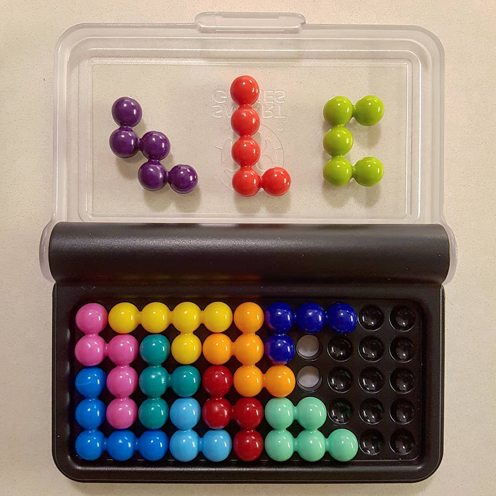
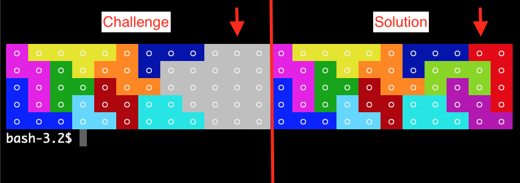

# IQ Puzzler PRO - Solution and research

## Overview

[IQ Puzzler PRO](https://www.smartgames.eu/uk/one-player-games/iq-puzzler-pro) - is a funny brain teasing pocket game toy.

This project is aimed not only to solve all puzzles but also to discover amount of combinations, ability to design new levels and create boards with different board size and pieces configuration.

## Quick start

Play: generates a random solvable challenge, press SPACE to watch the solver fill in the rest
step by step, using a recursive backtracking search (leftmost-empty-cell targeting + flood-fill
region pruning), the same engine used by the solution search script below.

    npm run play -- --speed 200 --pieces 9
    npm start

| Flag | Default | Description |
| --- | --- | --- |
| `--speed` | `200` | Delay in ms between visualized steps. `0` disables the delay (still shows every step, just back-to-back). |
| `--pieces` | `9` | How many pieces to pre-place as the starting challenge, `0`-`12`. `0` means solve the whole board from scratch; `12` means the board is already complete. |
| `--verbose` | off | Also visualize every candidate orientation/position the solver tries and rejects, not just successful placements and backtracks. |

`play` picks a random starting challenge from the repo's `solutions.json`. That file currently
ships with only **128 solutions** selected for visual diversity out of a much larger full search
(see [Diversity selection](#diversity-selection) below) — it's a demo-sized sample, not the
complete solution set, so replaying `play` many times will eventually start repeating challenges.

## Discovery

### Solution search script

#### Description and usage

Exhaustively finds every distinct tiling of the 11x5 board with all 12 pieces via recursive
backtracking:

    npm run solutions
    npm run solutions -- --silent

This pins all CPU cores for as long as it takes to exhaust the search space across 4 worker
threads — depending on hardware this can run for hours, so consider whether you want to run it
on a machine you don't mind tying up. Each solution is printed to the console as soon as it's
found (a long run can print a *lot* — pass `--silent` to suppress the board canvases and keep
only the self-updating progress line). Solutions are appended to `build/solutions.jsonl` as
they're found (one JSON array per line — [JSON Lines](https://jsonlines.org/), not a single JSON
object), flushed to disk on a schedule that starts at every 1s and doubles up to a 60s cap, so an
early interrupt loses very little and a long run isn't dominated by disk-flush overhead.
Interrupting the run (Ctrl+C) always does one final flush before exiting, so the file is never
left mid-write.

`build/solutions.jsonl` is not committed (see `.gitignore`) — the full result set is far too large
for the repo. Once a run finishes (or you interrupt it), view any range of what's been found so
far:

    node bin/view-solutions.js build/solutions.jsonl 0 10

or pick a small diverse subset for the repo's checked-in `solutions.json` — see
[Diversity selection](#diversity-selection).

#### Results report

<!-- TODO: fill in after running `npm run solutions` to completion.
     - Total distinct solutions found (post mirror-expansion):
     - build/solutions.jsonl file size:
     - Total wall-clock time:
     - Machine: Intel i5, 64GB DDR5, 2020
-->

#### How it works

- **Placement target**: at each step, find the leftmost empty cell (column-major scan — leftmost
  column first, top-to-bottom within it) and only try candidate pieces/orientations that cover it.
  This bounds the branching factor and, importantly, surfaces narrow/tight leftover regions (e.g.
  a slim strip at the bottom of the board) as the search target much sooner than scanning row by
  row would, so the solver rejects unfillable placements early instead of discovering the problem
  only after committing deep into an unrelated part of the board.
- **Pruning**: after a tentative placement, flood-fill the remaining empty cells into connected
  regions and reject the placement immediately if any region's size can't be reached by any
  combination of remaining pieces, or if no remaining piece/orientation can physically fit inside
  a small region — this is a cheap, deliberately not-fully-exhaustive check (fully verifying a
  region is solvable would mean running a second solver inside the pruning step), so it catches
  most dead branches early without becoming a bottleneck itself.
- **Mirror deduplication**: the 11x5 board has 4 symmetries (identity, horizontal flip, vertical
  flip, 180° rotation — no 90° since the board isn't square). Only one representative per
  symmetry-orbit of first-piece placements is actually searched; every found solution is expanded
  back into its (up to) 4 mirror variants before saving, so the search itself explores roughly 1/4
  of the space while the saved output still contains the full symmetric solution set.
- **Parallelism**: the reduced set of first-move candidates is split round-robin across 4 real
  OS threads (`worker_threads`, not the event loop), each running an independent search rooted at
  its assigned first moves; the main thread aggregates results, prints solutions as they arrive,
  and writes the combined output.

### Diversity selection

The full solution set found by `npm run solutions` can be enormous (hundreds of thousands to
millions of tilings) — far too many to commit to the repo or to make for an interesting `play`
experience (most pairs would look nearly identical). `bin/select-diverse.js` picks a small,
visually varied subset for the checked-in `solutions.json`:

    npm run select-diverse

Usage: `node bin/select-diverse.js [inputPath] [outputPath] [selectCount]` — defaults to reading
`build/solutions.jsonl`, writing `solutions.json` at the repo root, and selecting 128 solutions.

**How it works**: exact farthest-point sampling over the full set would mean comparing every pair
of solutions (`O(n²)`), impractical at millions of entries. Instead:
1. Stream the `.jsonl` file and reservoir-sample down to 10,000 candidates — only ever holding
   10,000 solutions in memory regardless of how large the input file is, and without needing to
   know the total count up front.
2. Greedily select the target count from that sample: start from a random solution, then
   repeatedly add whichever remaining candidate has the largest minimum distance to everything
   already selected (farthest-point sampling).
3. **Distance metric**: cell-level Hamming distance — render both solutions to their 55-cell board
   layout and count how many cells are covered by a different piece. Cheap and directly reflects
   "how different do these two layouts actually look."

This reliably produces a set with a much higher *minimum* pairwise distance than a plain random
sample of the same size (avoiding near-duplicate pairs), which is what actually matters for
variety in `play`'s challenges.

### TODO

- Ability to design new levels and create boards with different board size and pieces configuration.

## Tools

Print every orientation (rotations/flips) of every piece:

    npm run pieces

View a range of solutions from a `.jsonl` file produced by `npm run solutions` (defaults to
0-based index `0`, count `10`):

    node bin/view-solutions.js build/solutions.jsonl [startIndex] [count]
